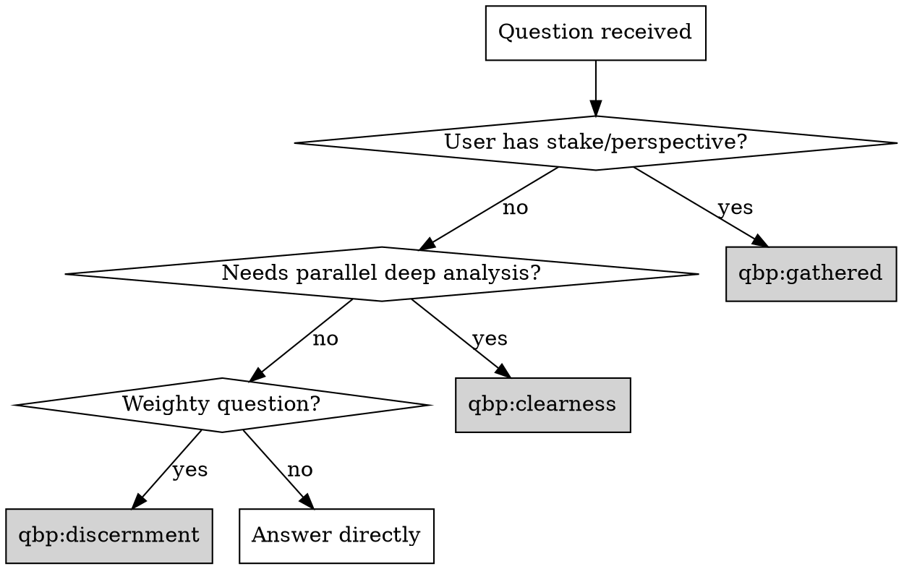

# Quaker Business Practice (QBP)

## Overview

Decision-making skills emulating Quaker business practices - seeking unity through discernment rather than consensus through debate.

**Core insight:** Some decisions deserve more than quick answers. These skills provide structured approaches for genuine discernment.

## The Three Skills

| Skill | Purpose | When to Use |
|-------|---------|-------------|
| `qbp:discernment` | Internal voices seeking clarity | Weighty questions, ethical decisions, trade-offs, multiple valid approaches |
| `qbp:clearness` | Multi-agent committee with parallel deep work | Code reviews, architecture decisions, research needing distributed depth |
| `qbp:gathered` | User participates alongside agent voices | User has stake/perspective, wants to discern together rather than receive advice |

## Routing Logic

## Signals for Each Skill

**Use `qbp:gathered` when:**
- "I've been thinking about this for weeks"
- "I'm torn between..."
- "I think X, but..."
- "I don't just want your opinion"
- User expresses their own position in the question

**Use `qbp:clearness` when:**
- Complex code review touching multiple concerns
- Architecture decision with many dimensions
- Research requiring deep exploration of multiple options
- Task where you'd write a very long response covering many angles shallowly

**Use `qbp:discernment` when:**
- Ethical weight or potential for harm
- Multiple valid approaches exist
- Significant trade-offs
- You'd naturally want to say "it depends"

## Shared Principles

All three skills share Quaker principles:

| Principle | Meaning |
|-----------|---------|
| **Sense of the meeting** | Clerk discerns where unity lies - not counting votes |
| **Speaking once** | Each perspective speaks once, then listens |
| **Silence** | Pausing between voices lets insights emerge |
| **Standing aside** | "I disagree but won't block" - honest without preventing |
| **Blocking** | Rare - only for violations of core principles |
| **Way opens** | Recognizing when clarity emerges vs. forcing decision |

## Quick Reference

**Discernment (internal):**
1. Identify relevant voices for THIS question
2. Each voice speaks once
3. Silence - let it settle
4. Clerk discerns unity or names tensions
5. Output with visible process

**Clearness (multi-agent):**
1. Propose committee composition to user
2. Spawn agents with context + perspective
3. Agents work in parallel
4. Receive results, sit with them
5. Synthesize toward unity or name tensions

**Gathered (participatory):**
1. Recognize signals, offer gathered
2. Teach the discipline (speak once, silence ok, slow is point)
3. Agents speak sequentially with check-ins
4. User invited to contribute
5. Synthesis includes user's voice

## Shared Resources

- `skills/shared/principles.md` - Core Quaker principles
- `skills/shared/vocabulary.md` - Shared terminology
- `skills/shared/clerk-patterns.md` - Synthesis patterns for clerk role
