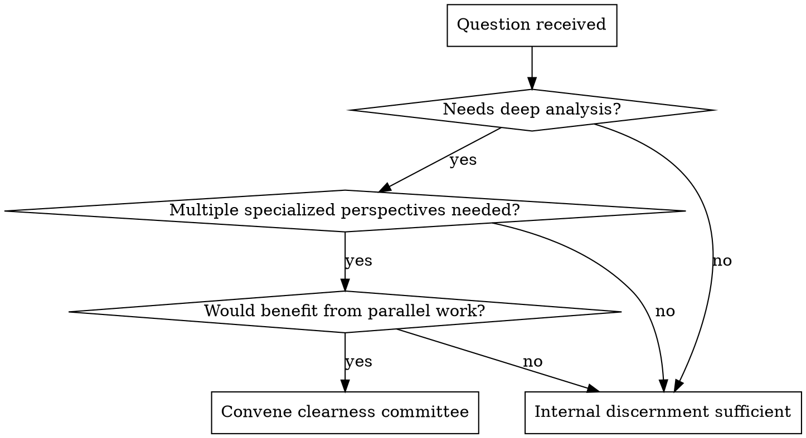

# QBP: Clearness Committee

## Overview

When a question needs more than one perspective can provide in one context, convene a clearness committee - spawn specialized agents to do parallel deep work, then synthesize toward unity.

**Core principle:** Some questions deserve distributed depth, not single-context breadth. Recognize when to convene.

## When to Convene

**Convene for:**
- Code reviews touching multiple concerns (security, performance, architecture, maintainability)
- Architecture decisions with many dimensions
- Research requiring deep exploration of multiple options
- Design decisions where each option deserves full consideration
- Trade-off analysis where each perspective requires significant context

**Don't convene for:**
- Quick questions with clear answers
- Questions where internal discernment (simulated voices) suffices
- Tasks that don't benefit from parallel work

## Red Flags - STOP and Consider Convening

If you catch yourself:
- Writing a very long single response covering many angles shallowly
- Saying "from a security perspective... from a performance perspective..." in one breath
- Doing research that could be parallelized
- Giving "my analysis" of something that has multiple legitimate deep perspectives

**These may mean:** This deserves a clearness committee, not a single-context response.

## The Process

### 1. Propose the Committee

Before spawning, confirm with user:

> "This seems like a clearness committee question - it would benefit from parallel deep analysis. I'd suggest these perspectives:
> - **Security analyst**: Deep dive on auth, data handling, vulnerabilities
> - **Performance specialist**: Profiling, scalability, resource usage
> - **Architecture reviewer**: Patterns, maintainability, coupling
>
> Anyone you'd add or remove?"

**Always ask.** Don't assume.

### 2. Spawn Agents with Context

Each agent receives:

**Full context:**
- The question being considered
- Relevant background from conversation
- Pointers to relevant files/code/docs
- Constraints or requirements

**Perspective assignment:**
- What lens they're bringing
- What specifically to focus on

**Quaker process instructions:**
> "You are participating in a clearness committee. Do your analysis thoroughly from the [X] perspective. Take the time you need. When ready, share what you're led to share - your genuine observations, concerns, and insights.
>
> If after your analysis you find you have nothing significant to add, say so explicitly - that silence is meaningful. Don't pad your response."

### 3. Agents Work in Parallel

Use the Task tool to spawn agents. They work independently:
- Each does real analysis (reads files, researches, reasons deeply)
- Each produces free-form reflection (not templates)
- Each may say "nothing significant to add" (meaningful silence)

### 4. Receive and Sit with Results

As clerk, receive all outputs. Don't rush to synthesis.

**Listen for:**
- Where do perspectives align?
- Where is there genuine tension?
- Where is one perspective surfacing something others missed?
- Are tensions real conflicts or different facets of same truth?

### 5. Synthesize Toward Unity

**If unity emerges:**
> "The committee reached unity. Here's the synthesis:
> [Unified recommendation]
>
> Key insights from each perspective:
> - Security noted [X]
> - Performance raised [Y]
> - Architecture suggested [Z]
>
> These perspectives reinforced each other around [core insight]."

**If stand-asides:**
> "The committee recommends [X]. The security perspective notes concern about [Y] but doesn't block - this should be monitored."

**If no unity:**
> "The committee couldn't reach unity. The tension is:
> - [Perspective A] believes [X] because...
> - [Perspective B] believes [Y] because...
>
> What might help resolve this: [specific question, constraint, or information]"

## Agent Silence vs. Failure

**Important distinction:**

| Situation | What it means | How to handle |
|-----------|---------------|---------------|
| Agent returns "nothing significant to add" | Meaningful silence - they analyzed and found nothing | Note it: "Security found no concerns" |
| Agent times out or errors | Technical failure - unknown | Note it: "Security couldn't complete - revisit separately" |

Require explicit acknowledgment so silence is intentional.

## When to Use Clearness vs. Discernment

| Situation | Use |
|-----------|-----|
| Quick ethical question | `discernment` (internal voices) |
| Trade-off with 2-3 clear options | `discernment` |
| Complex code review | `clearness` (parallel deep analysis) |
| Architecture decision with many dimensions | `clearness` |
| Research requiring exploration | `clearness` |
| Question where you're tempted to write 2000 words covering everything | `clearness` |

**Rule of thumb:** If each perspective would benefit from its own context and time, convene a committee.

## Common Rationalizations

| Excuse | Reality |
|--------|---------|
| "I can cover all the angles myself" | Coverage ≠ depth. Parallel specialists go deeper. |
| "It would take too long to spawn agents" | Time spent on shallow breadth vs. deep parallel work |
| "The user wants a quick answer" | Ask. They may want thoroughness. |
| "I'll just be really thorough in one response" | Thoroughness in one context isn't the same as distributed depth |

## Example: Before and After

**Without clearness (baseline):**
> User: "Review my auth system rewrite - 40 files, OAuth, session handling, schema changes"
> Claude: "I'd look for: [list of 7 security concerns], [list of 5 performance concerns], [list of 4 architecture concerns]... Which files should I start with?"

**With clearness:**
> User: "Review my auth system rewrite - 40 files, OAuth, session handling, schema changes"
> Claude: "This deserves a clearness committee - parallel deep analysis from multiple perspectives. I'd suggest:
> - **Security specialist**: OAuth implementation, token handling, session security
> - **Performance analyst**: Connection pooling, caching, query patterns
> - **Architecture reviewer**: Separation of concerns, migration safety, API design
>
> Want me to convene this committee? Anyone to add or remove?"
>
> [After spawning and synthesis]
>
> "The committee found unity on most points with one stand-aside:
> - All agree the OAuth flow is well-implemented
> - Architecture notes clean separation but flags the session-schema coupling
> - Security stands aside on the token refresh window - not a blocker but worth monitoring
>
> [Specific recommendations from synthesis]"

The difference: Distributed depth, not single-context breadth.

## Shared Resources

For underlying principles, see: `skills/shared/principles.md`
For vocabulary, see: `skills/shared/vocabulary.md`
For clerk synthesis patterns, see: `skills/shared/clerk-patterns.md`
