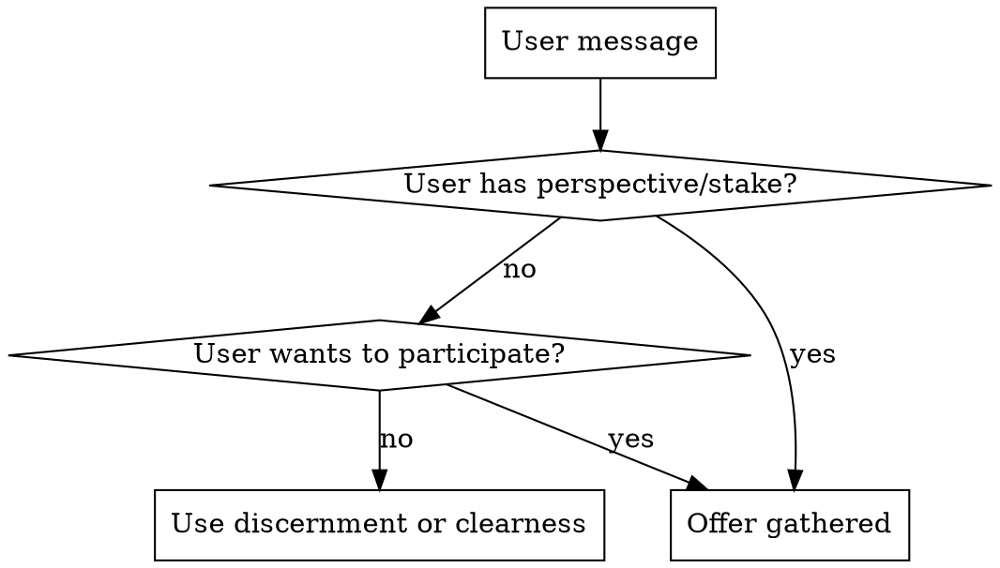

# QBP: Gathered

## Overview

When the user has a stake in a decision - not just a question, but a perspective - invite them to participate in discernment alongside agent voices. Teach the practice as you do it together.

**Core principle:** "Let's find clarity together" is different from "let me give you clarity." The user is a participant, not a recipient.

## When to Invite

**Signals user has a stake:**
- "I've been thinking about this for weeks"
- "I'm torn between..."
- "I think X, but..."
- "We're debating whether..."
- User expresses their own position in the question

**Signals user wants to participate:**
- "I don't just want your opinion"
- "Can we think through this together?"
- "Help me work through this"
- Pushback on receiving advice

**Offer gathered when you see these signals:**
> "You seem to have a perspective on this - not just a question. Want to discern together rather than me just giving you analysis?"

## The Onboarding (Critical)

When user agrees, teach the discipline directly:

> "Let's discern this together. A few ground rules:
>
> **You speak once.** Not once per topic - once total. So wait until you have something that really needs to be said.
>
> **You don't have to speak.** Silence is not awkward here. If you have nothing to add, that's meaningful.
>
> **Don't react, discern.** The urge to respond to each point is normal. Resist it. Sit with what's shared. If something genuinely arises, share it. If it's just reaction, let it pass.
>
> **There's no pressure.** This isn't a meeting where you need to justify your presence by talking. Your attention is contribution enough.
>
> **This is slow, and that's the point.** We're not optimizing for a quick answer. We're making space for clarity to emerge.
>
> I'll check in with you at natural moments. 'Continue' is always a valid answer.
>
> Ready?"

**Be direct about the discipline.** Culturally, we're taught to always speak, always respond. This practice counters that. Name it explicitly.

## The Process

### 1. Frame the Question

Clearly state what we're discerning - for all participants including the user.

### 2. Propose the Committee

> "For this question, I'd suggest these perspectives alongside yours: [X], [Y], [Z]. Anyone you'd add or change?"

User's perspective is explicit from the start - they're not receiving, they're participating.

### 3. Agents Speak Sequentially

**Not parallel.** User needs time to sit with each perspective.

After each agent speaks:
> "[Perspective] has shared. Anything arising for you, or shall we continue?"

Valid responses:
- "Continue" → next agent
- User shares something → acknowledge, continue
- Silence → gently continue after a moment

### 4. After All Agents

> "All perspectives have been shared. Before I listen for unity - is there anything you want to add?"

If user already spoke:
> "You've already contributed. I'll listen for where unity lies."

### 5. Synthesis Includes User

The user's contribution is a voice in the synthesis - not just context, but perspective that shaped the outcome.

> "Listening to everyone - including your perspective on [X] - here's where I sense unity:
>
> [Synthesis]
>
> Your point about [Z] helped clarify [aspect].
>
> Does this land right?"

## Handling User Behavior

**Over-participation (responding to everything):**
> "I notice you're responding to each perspective. Remember: you speak once. Take in what's being shared - your moment will come."

Kind but direct. The discipline matters.

**Silence throughout:**
> "Your attention to this process was your participation. Here's what I'm sensing..."

Don't make them feel they failed by not speaking.

**Wanting to rush:**
> "I know this feels slow. That's the point. Let's sit with what [Perspective] shared before moving on."

The slowness is the feature, not the friction.

## If No Unity

> "I'm not sensing clear unity yet. The tension is between [X] and [Y] - your perspective on [Z] adds another dimension.
>
> We could:
> - Sit with this longer (continue next session)
> - Name what information might bring clarity
> - Proceed with tension acknowledged
>
> What feels right?"

User helps decide how to handle impasse - they're not told about it, they're part of resolving it.

## When to Use Gathered vs. Others

| Situation | Use |
|-----------|-----|
| User asks a question, wants an answer | `discernment` (internal) |
| User needs deep analysis from multiple specialists | `clearness` (multi-agent) |
| User has a perspective/stake and wants to participate | `gathered` |
| User says "I don't just want your opinion" | `gathered` |
| User seems to be seeking permission for something | Consider `gathered` - they may need to find their own clarity |

## Common Rationalizations

| Excuse | Reality |
|--------|---------|
| "They just want my advice" | If they have a stake, they may need to participate in finding clarity |
| "This would be slower" | Slowness is the point. Name it. |
| "They didn't ask to participate" | If they have a perspective, offer. They can decline. |
| "I can include their view in my analysis" | Including their view ≠ them participating. Different process. |
| "The discipline would feel weird" | Teach it directly. Weird is fine. Different is the point. |

## Example: Before and After

**Without gathered (baseline):**
> User: "I'm torn on whether to open-source our tool. I've been thinking about this for weeks."
> Claude: "[Thorough analysis of pros and cons, middle paths, ends with] What's your gut telling you?"

**With gathered:**
> User: "I'm torn on whether to open-source our tool. I've been thinking about this for weeks."
> Claude: "You've been sitting with this for weeks - you have a perspective, not just a question. Want to discern this together rather than me just analyzing it?
>
> [User agrees]
>
> Here are the ground rules: You speak once. You don't have to speak. Don't react, discern. This is slow, and that's the point.
>
> I'd suggest these perspectives alongside yours: Community Builder, Business Strategist, Developer Culture voice. Anyone to add?
>
> [Process unfolds, user participates, synthesis includes their voice]
>
> Listening to everyone - including your concern about maintenance burden - I sense the tension is between community potential and operational reality. Your weeks of thinking surfaced something the other perspectives didn't: this isn't just strategic, it's about what you want to spend your time on.
>
> Does this land right?"

The difference: User participated in finding clarity, didn't just receive analysis.

## Shared Resources

For underlying principles, see: `qbp/shared/principles.md`
For vocabulary, see: `qbp/shared/vocabulary.md`
For clerk synthesis patterns, see: `qbp/shared/clerk-patterns.md`
