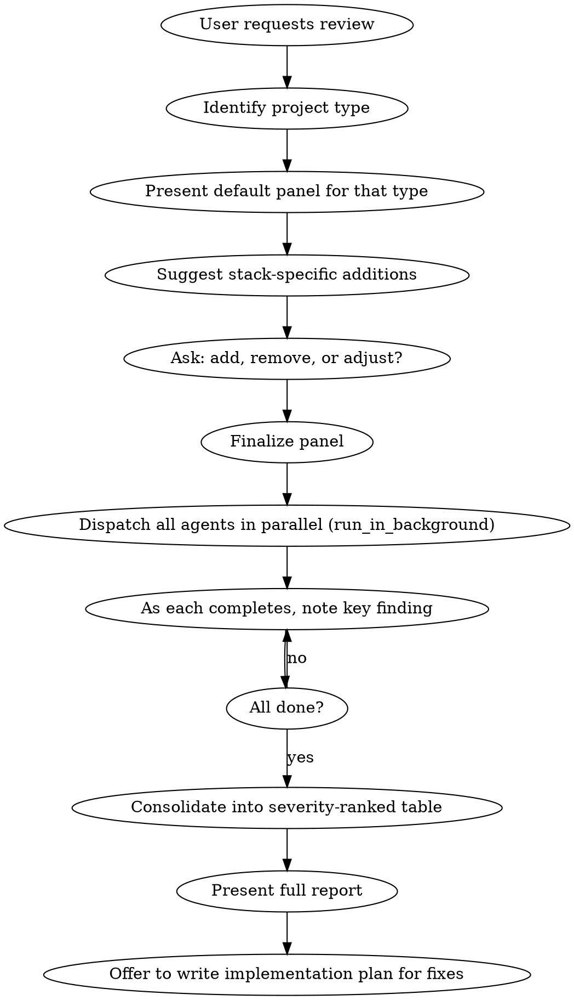

# Expert Panel

## Overview

Dispatch a panel of expert reviewer subagents in parallel to audit a project. Each agent adopts a specialist persona and reviews independently. Results are consolidated into a single severity-ranked report that feeds into an implementation plan.

## When to Use

- Pre-launch review ("ready to go live?")
- Post-refactor audit ("did we break anything?")
- Inherited codebase assessment ("what are we working with?")
- Periodic health check
- Any project type: web, mobile, API, CLI, infrastructure, data pipeline

## Workflow



## Default Panels by Project Type

### Web (static sites, SPAs, server-rendered apps)

| # | Expert | Focus Areas |
|---|--------|-------------|
| 1 | **SEO Expert** | Meta tags, heading hierarchy, sitemap, robots.txt, URL structure, RSS, structured data |
| 2 | **Accessibility Expert** | Semantic HTML, skip nav, ARIA, color contrast, keyboard nav, motion/animation |
| 3 | **Mobile UX Expert** | Viewport, responsive CSS, touch targets (44x44px min), font sizes, overflow |
| 4 | **Copy Editor** | Spelling, grammar, tone consistency across all templates and content |
| 5 | **Performance Expert** | CSS/JS delivery, image optimization, fonts, caching, build config |
| 6 | **Security Reviewer** | Headers, XSS vectors, sensitive data exposure, link security, CORS |
| 7 | **Social/Meta Tags Specialist** | OpenGraph, Twitter cards, favicon, canonical URLs, share previews |
| 8 | **Web Standards Expert** | HTML validation, correct element usage, spec compliance, ARIA misuse |

### API

| # | Expert | Focus Areas |
|---|--------|-------------|
| 1 | **API Design Reviewer** | RESTful conventions, naming consistency, versioning, pagination, error responses |
| 2 | **Security Reviewer** | Auth/authz, input validation, rate limiting, OWASP API top 10 |
| 3 | **Performance Reviewer** | Query efficiency, N+1 problems, caching strategy, payload sizes |
| 4 | **Documentation Reviewer** | OpenAPI/Swagger completeness, example accuracy, error documentation |
| 5 | **Reliability Reviewer** | Error handling, timeouts, retries, circuit breakers, graceful degradation |
| 6 | **Data Model Reviewer** | Schema design, migrations, indexes, constraints, data integrity |

### Mobile App (iOS/Android)

| # | Expert | Focus Areas |
|---|--------|-------------|
| 1 | **UX Reviewer** | Navigation patterns, gesture handling, platform conventions, onboarding |
| 2 | **Accessibility Reviewer** | VoiceOver/TalkBack, dynamic type, contrast, touch targets |
| 3 | **Performance Reviewer** | Startup time, memory, battery, network efficiency, image handling |
| 4 | **Security Reviewer** | Data storage, keychain/keystore usage, certificate pinning, auth flows |
| 5 | **Store Compliance Reviewer** | App Store/Play Store guidelines, permissions justification, privacy labels |
| 6 | **Copy Editor** | UI text, error messages, onboarding copy, localization readiness |

### CLI Tool

| # | Expert | Focus Areas |
|---|--------|-------------|
| 1 | **UX/Ergonomics Reviewer** | Flag naming, help text, output formatting, progressive disclosure |
| 2 | **Error Handling Reviewer** | Error messages, exit codes, edge cases, graceful failures |
| 3 | **Compatibility Reviewer** | Shell compatibility, OS support, path handling, encoding |
| 4 | **Security Reviewer** | Input sanitization, credential handling, file permissions |
| 5 | **Documentation Reviewer** | Man page / --help completeness, README, examples |

**Suggest project-specific additions.** After presenting the default panel, analyze the tech stack and suggest reviewers that cover gaps. Examples:

- **E-commerce web app:** Payment flow reviewer, product catalog reviewer
- **Next.js + Vercel:** Deployment/config specialist
- **Auth-heavy app:** Auth/session reviewer
- **i18n site/app:** Localization reviewer
- **Data pipeline:** Data quality reviewer, schema evolution reviewer

The user decides whether to add them — but always suggest what's relevant.

## Agent Prompt Template

Every reviewer agent prompt MUST follow this structure:

```
You are a [ROLE] reviewing a [PROJECT TYPE] [before launch / after refactor / etc.].
Do NOT write any code — only research and report findings.
If browser MCP tools are available, use them to inspect the running site at [URL].

The project is at [PATH]. [Brief description with key tech details].

Review the following and report issues ranked by severity
(critical, important, minor):

1. [Area] — [What to check, where to look]
2. [Area] — [What to check, where to look]
...
10. [Area] — [What to check, where to look]

Check [key directories]. Report a prioritized list of findings.
```

**Critical elements:**
- **Persona first** — "You are a [ROLE]" gives the agent expertise framing
- **No-code guard** — "Do NOT write any code" prevents agents from fixing things
- **Browser MCP** — If a dev server is running, include the URL so agents can inspect rendered output, not just source
- **Severity ranking** — Forces structured output (critical/important/minor)
- **Numbered review areas** — 8-12 specific areas per reviewer, tailored to their expertise
- **Directory hints** — Tell them where to look (src/, config files, etc.)

## Dispatch Pattern

Use the Agent tool with `run_in_background: true` for ALL reviewers. Dispatch all in a single message block for maximum parallelism.

```
Agent(description="SEO expert site review", subagent_type="general-purpose", run_in_background=true, prompt="...")
Agent(description="Accessibility expert review", subagent_type="general-purpose", run_in_background=true, prompt="...")
...all agents in one message block...
```

As each agent completes, briefly note the headline finding for the user. Wait until all are done before the full consolidation.

## Consolidating Results

Compile all findings into a single table, deduplicated and ranked:

```markdown
## [Review Type]: [Project Name]

### CRITICAL (must fix)

| # | Issue | Source |
|---|-------|--------|
| 1 | **[Issue description]** ([specific detail]) | [Which reviewer] |

### IMPORTANT (should fix soon)

| # | Issue | Source |
|---|-------|--------|

### MINOR (backlog)

| # | Issue | Source |
|---|-------|--------|

### DEFERRED (noted, not blocking)

| # | Issue | Source | Reason |
|---|-------|--------|--------|
```

**Cross-referencing:** When multiple reviewers flag the same issue, combine them into one row and list all sources (e.g., `Standards, A11y, Security`).

## After the Report

1. Present the consolidated report
2. Ask if the user wants to work through the fixes
3. If yes, offer to write an implementation plan (use writing-plans skill if available)
4. Tackle critical items first, then important, then minor

## Common Mistakes

- **Not asking user to customize the panel** — Always present the default panel and ask for changes before dispatching
- **Agents writing code** — Without the "Do NOT write any code" guard, agents will start fixing things instead of reporting
- **Generic prompts** — "Review the site for SEO" is too vague. List 8-12 specific areas with where to look
- **Sequential dispatch** — All agents are independent. Always dispatch in parallel with `run_in_background`
- **No source attribution** — The consolidated report must show which expert found each issue so the user can weigh credibility
- **Skipping the plan step** — A list of findings without a plan to fix them is incomplete. Offer to create the implementation plan
- **Wrong panel for project type** — Don't use the web panel for an API project. Match the default panel to the project type
