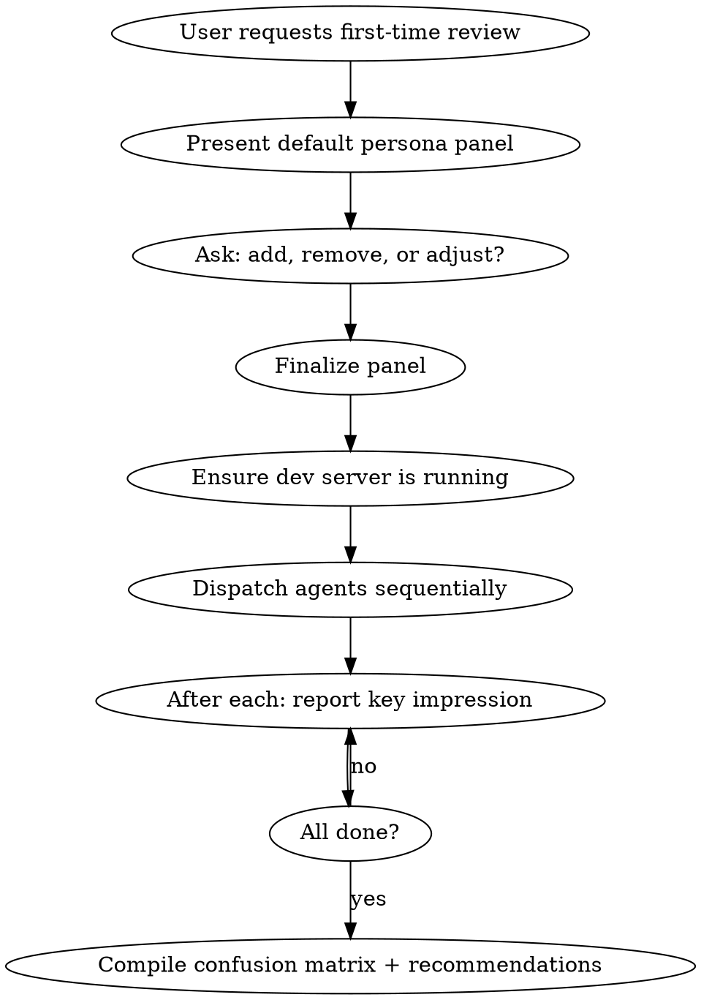

# Normies

## Overview

Dispatch a panel of subagents, each role-playing a person with a different level of tech sophistication, who land on a site with zero context. They report what they understand, what confuses them, and where they give up. The organizing principle is the **sophistication spectrum** — from expert to novice.

**This is NOT a technical review.** The review-squad:experts skill handles code quality, SEO, accessibility compliance, etc. This skill answers: "Do real people understand my site?"

## When to Use

- Before launch: "Will visitors understand what this is?"
- After redesign: "Did we make things clearer or more confusing?"
- New landing page: "Does this page communicate what we want?"
- Periodic check: "Have we lost sight of the newcomer experience?"

## Workflow



**Sequential dispatch required.** Browser MCP tools share a single browser instance. Agents must run one at a time, not in parallel.

## The Default Panel (6 Personas)

Present this spectrum to the user before dispatching. They may adjust.

| # | Persona | Sophistication | Patience | Gives up after |
|---|---------|---------------|----------|----------------|
| 1 | **Senior Developer** | Expert | Low — notices every flaw | 30 seconds of confusion |
| 2 | **Product Manager** | High | Medium — goal-oriented, wants to "get it" fast | 45 seconds without clarity |
| 3 | **College Student** | Medium — digital native, low effort | Very low — scrolls fast, judges visually | 10 seconds of boredom |
| 4 | **Small Business Owner** | Medium — uses web daily, not technical | Low — busy, needs answers NOW | 60 seconds without finding what they need |
| 5 | **Retired Teacher** | Low — reads carefully, confused by jargon | High — will try, but gives up when lost | 2 minutes of confusion |
| 6 | **Someone's Grandparent** | Minimal — icons are meaningless, jargon is alien | Very high — wants to understand, easily defeated | First moment of real confusion |

**Suggest additions based on the site's audience.** If the site targets developers, add a junior dev. If it's a restaurant, add a hungry person on their phone. Match the personas to who will actually visit.

## Agent Prompt Template

Every agent prompt MUST follow this structure:

```
You are [NAME], a [AGE]-year-old [OCCUPATION/DESCRIPTION].
[2-3 sentences of personality and web behavior.]
You have NEVER seen this site before. You know NOTHING about it.

Do NOT read any source code or project files. You are a visitor, not a developer.
If browser MCP tools are available, use them to visit the site at [URL].

YOUR EXPERIENCE:
1. Navigate to [URL]. Take a screenshot.
2. In the first [TIME LIMIT] seconds, answer: What is this site about?
   If you can't tell, say so honestly.
3. Try to find [SOMETHING RELEVANT TO THIS PERSONA].
4. Navigate wherever feels natural to you. Take screenshots.
5. Note every moment you feel confused, lost, or unsure what to do.
6. Note every piece of jargon or text you don't understand.
7. When you would give up in real life, STOP. Say why.

Write your report IN CHARACTER as [NAME]. Be honest. Structure it as:
- **First Impression** (what I saw and thought in the first 5 seconds)
- **What I Think This Site Is About** (honest interpretation)
- **Where I Got Confused** (every point of friction, in order)
- **Where I Gave Up** (what finally stopped me, or "I didn't")
- **What I Couldn't Find** (things I wanted but couldn't locate)
- **Words I Didn't Understand** (jargon list)
- **What I Liked** (be fair)
```

**Critical elements:**
- **Rich persona** — Name, age, personality, web behavior. Not just "a casual user."
- **No-code guard** — "Do NOT read any source code." This is the most important rule. Cold impressions only.
- **Time limit** — Each persona has a patience threshold. When they'd leave in real life, they stop.
- **In-character reporting** — The retired teacher writes like a retired teacher. This surfaces different language and priorities.
- **Screenshot-driven** — Take screenshots at key moments so the user can see what the persona saw.

## Dispatch Pattern

**Sequential, not parallel.** Browser MCP shares a single browser instance.

```
Agent 1 (Senior Developer) → collect report
Agent 2 (Product Manager) → collect report
...
Agent 6 (Grandparent) → collect report
```

After each agent completes, briefly share the headline impression with the user before moving to the next.

## Consolidating Results

After all personas report, compile a **confusion matrix**:

```markdown
## Normies Review: [Site Name]

### Confusion Matrix

| Issue | Dev | PM | Student | Business | Retired | Grandparent |
|-------|:---:|:--:|:-------:|:--------:|:-------:|:-----------:|
| Can't tell what site is about | | | ✗ | ✗ | ✗ | ✗ |
| Can't find contact info | | | | ✗ | ✗ | ✗ |
| Jargon in hero text | | | | ✗ | ✗ | ✗ |
| Hamburger menu not recognized | | | | | | ✗ |

### Severity (by how many personas hit it)

- **6/6 or 5/6** → CRITICAL — nearly everyone is confused
- **3/6 or 4/6** → IMPORTANT — most non-technical visitors struggle
- **1/6 or 2/6** → MINOR — only edge cases

### Recommendations (prioritized)

| Priority | Issue | Who's confused | Suggested fix |
|----------|-------|---------------|---------------|
| 1 | ... | 5/6 personas | ... |
| 2 | ... | 3/6 personas | ... |
```

**The confusion matrix is the key deliverable.** It shows at a glance which problems are universal vs. which only affect certain sophistication levels.

## After the Report

1. Present the confusion matrix and recommendations
2. Ask if the user wants to fix the issues
3. If yes, prioritize by how many personas were affected (universal confusion first)

## Common Mistakes

- **Reading the code first** — Agents must be cold visitors. Code knowledge contaminates their impressions.
- **Technical testing instead of impression testing** — This is NOT an a11y audit or SEO check. Those belong in review-squad:experts.
- **Flat personas** — "A casual user" is not a persona. Give them a name, age, job, personality, and specific web behavior patterns.
- **No patience threshold** — Real people leave when confused. Agents should too.
- **Reporting in third person** — In-character reporting surfaces different language and priorities. Margaret doesn't say "the information architecture is unclear" — she says "I don't know where anything is."
- **Running in parallel** — Browser MCP is a shared resource. Sequential only.
