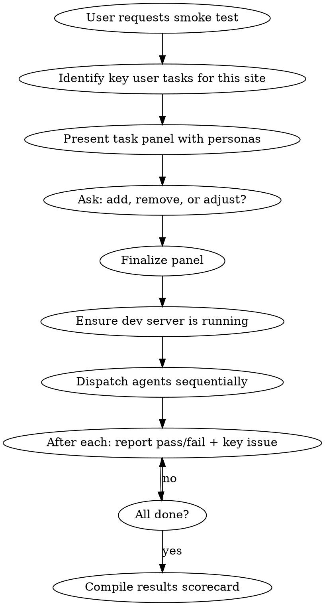

# Regulars

## Overview

Dispatch a panel of subagents, each role-playing a real user with a specific task to complete on the site. They navigate using browser MCP tools, attempt to complete their goal, and report what broke, what was frustrating, and whether they succeeded. The organizing principle is **task completion** — can users do what they came to do?

**This is NOT a QA test suite or expert audit.** Regulars agents behave like real users — they don't inspect source code, they don't check every element, and they don't follow a test matrix. They try to accomplish a goal the way a real person would.

## When to Use

- Before launch: "Does the site actually work end-to-end?"
- After deploy: "Did we break any user flows?"
- After refactor: "Can users still do the important things?"
- Periodic check: "Are the critical paths still working?"

## Workflow



**Sequential dispatch required.** Browser MCP tools share a single browser instance.

## Designing the Task Panel

Unlike review-squad:experts (fixed default panel) or review-squad:normies (fixed sophistication spectrum), regulars tasks are **site-specific**. You must design them based on what the site does.

**Step 1:** Ask the user what the key user flows are, OR read the site's navigation/content to identify them.

**Step 2:** For each flow, create a persona with a goal:

| Component | Example |
|-----------|---------|
| **Name + personality** | "Sarah, a busy parent browsing on her phone during lunch break" |
| **Goal** | "Find a birthday gift under $50 and add it to cart" |
| **How they'd approach it** | "Scrolls fast, uses search if available, sorts by price" |

**Step 3:** Present the panel to the user for approval.

### Example Panels by Site Type

**Personal blog/portfolio:**

| # | Persona | Task |
|---|---------|------|
| 1 | Recruiter scanning quickly | Find what this person does and their experience |
| 2 | Blog reader | Find a post on a specific topic and read it |
| 3 | Old friend | Find contact info or a way to reach out |
| 4 | RSS subscriber | Find and subscribe to the RSS feed |
| 5 | Social media visitor | Land on a shared blog post, explore from there |
| 6 | Fellow developer | Find their GitHub/projects |

**E-commerce:**

| # | Persona | Task |
|---|---------|------|
| 1 | Gift shopper | Find something under $50, add to cart, start checkout |
| 2 | Comparison shopper | Browse a category, filter/sort, compare two products |
| 3 | Return visitor | Find order status or return policy |
| 4 | Newsletter subscriber | Find and complete the signup form |
| 5 | Mobile buyer | Complete a purchase on a phone-sized viewport |
| 6 | Coupon user | Apply a discount code at checkout |

**SaaS/product site:**

| # | Persona | Task |
|---|---------|------|
| 1 | Evaluator | Understand the product and find pricing |
| 2 | Free trial user | Sign up for a trial account |
| 3 | Support seeker | Find documentation or help |
| 4 | Enterprise buyer | Find enterprise/contact sales info |
| 5 | Existing user | Log in and check account settings |
| 6 | Developer | Find API docs or integration guide |

## Agent Prompt Template

```
You are [NAME], a [DESCRIPTION].
[1-2 sentences of personality and how you browse.]
You have come to this site to: [SPECIFIC GOAL].

Do NOT read any source code or project files. You are a real user.
Use the browser MCP tools to navigate the site at [URL].
[If mobile persona: First, set viewport to 375x812.]

YOUR TASK:
1. Navigate to [URL]. Take a screenshot.
2. Try to accomplish your goal: [GOAL].
3. Do what feels natural — click what looks right, search if you can,
   scroll where you'd scroll. Don't be methodical — be human.
4. Take a screenshot at each major step.
5. If something doesn't work (broken button, error page, dead end),
   try what a real person would try (back button, refresh, different path).
6. Test one unhappy path: [SPECIFIC EDGE CASE FOR THIS TASK].
7. When you've either completed your goal or given up, STOP.

Report as [NAME]:
- **Goal**: [restate the goal]
- **Result**: COMPLETED / PARTIALLY COMPLETED / FAILED
- **Steps Taken**: numbered list of what you did
- **Where It Broke**: exact moment something went wrong (if applicable)
- **Frustrations**: anything annoying even if it technically worked
- **Time to Complete**: rough estimate (fast / reasonable / painfully slow)
- **Would I Come Back?**: honest yes/no
```

**Critical elements:**
- **No-code guard** — "Do NOT read any source code." Regulars are users, not developers.
- **Specific goal** — Not "explore the site" but "find a gift under $50 and add it to cart."
- **One unhappy path per agent** — Test what happens when things go wrong (invalid input, empty cart, back button mid-flow).
- **Human behavior** — "Do what feels natural" not "follow this test script step by step."
- **Honest verdict** — "Would I come back?" forces a real assessment.

## Dispatch Pattern

**Sequential, not parallel.** Browser MCP shares a single browser instance.

After each agent, briefly report pass/fail + headline issue to the user.

## Consolidating Results

Compile into a scorecard:

```markdown
## Regulars Review: [Site Name]

### Scorecard

| # | Task | Persona | Result | Issues |
|---|------|---------|--------|--------|
| 1 | Find and read blog post | Blog reader | ✅ PASS | Minor: date format inconsistent |
| 2 | Subscribe to newsletter | Casual visitor | ❌ FAIL | Form returns 500 error |
| 3 | Find contact info | Old friend | ✅ PASS | |
| 4 | Browse photo gallery | Gallery visitor | ⚠️ PARTIAL | Lightbox doesn't close on mobile |
| 5 | Find RSS feed | RSS subscriber | ❌ FAIL | No visible RSS link anywhere |
| 6 | Navigate from shared link | Social visitor | ✅ PASS | |

### Result: 4/6 PASS, 1 PARTIAL, 1 FAIL

### Blockers (failed tasks)
| Task | What broke | Severity |
|------|-----------|----------|
| Newsletter signup | 500 error on form submit | CRITICAL |
| Find RSS feed | No RSS link discoverable | IMPORTANT |

### Friction (passed but painful)
| Task | What was frustrating |
|------|---------------------|
| Browse gallery | Lightbox close button too small on mobile |

### What Worked Well
- Blog reading flow is smooth end-to-end
- Contact info is easy to find
- Shared link landing experience is clean
```

## After the Report

1. Present the scorecard
2. Blockers are the priority — tasks that completely failed
3. Ask if the user wants to fix blockers now
4. Friction items go on the backlog

## Common Mistakes

- **Reading the code** — Regulars don't know the codebase. Neither should the agents.
- **Generic tasks** — "Browse the site" is not a valid task. Each agent needs a specific goal with a clear pass/fail.
- **Only happy paths** — Real users hit edge cases. Each agent should test one unhappy path.
- **QA test scripts** — "Click element #submit, verify response code 200" is a test script, not what regulars do. Agents should behave like humans.
- **Running in parallel** — Browser MCP is a shared resource. Sequential only.
- **Using the same panel for every site** — Tasks must match what THIS site offers. A blog doesn't need a "checkout flow" tester.
